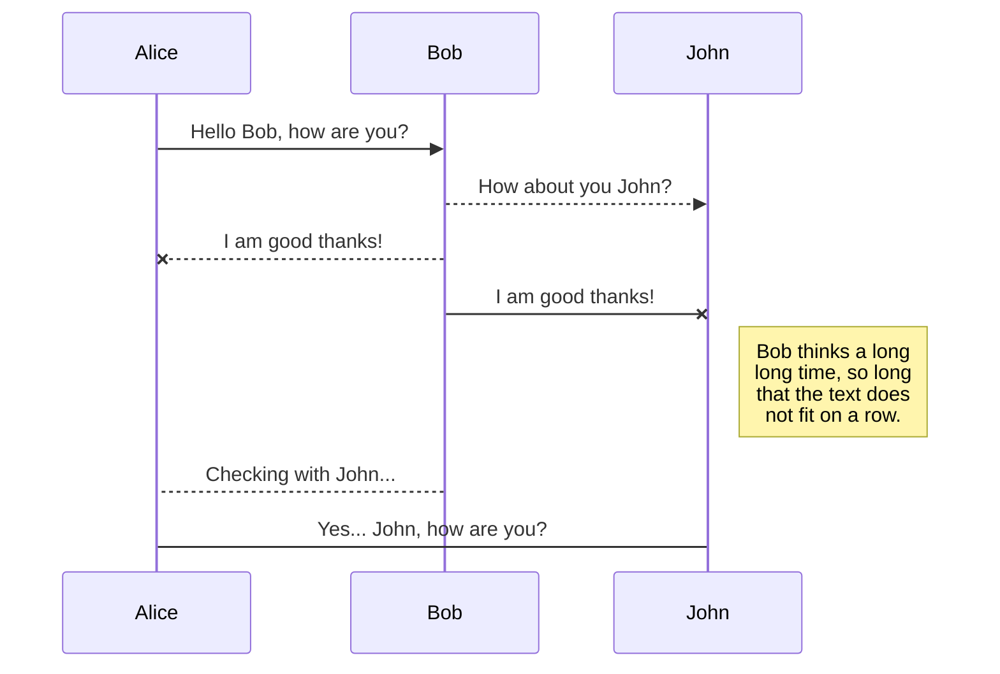
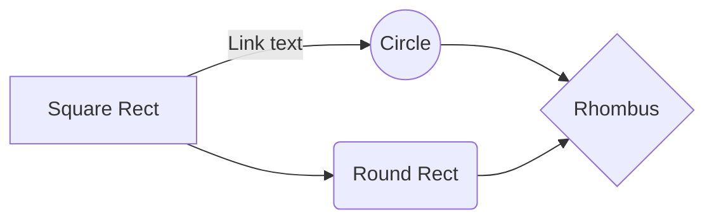

# WKMPlayer 文档

本文档面向开发人员、测试人员、合作伙伴及对此感兴趣的其他用户，使用该 SDK 需具备基本的 IOS 开发能力。

# 1 功能特性

 - H.264硬编码 
 - AAC 音频硬编码  
 - 弱网丢帧策略  
 - 支持静音操作
#  2 开发准备
## 2.1 开发环境配置
 - Xcode 
 - 更新 WESDK
 - 导入 W3MUI.framework 动态库

## 2.2 设备 & 系统要求

 - 最低支持 iOS 版本：播放端 iOS8.0 
 - 最低支持 iPhone 型号：播放端 iPhone5 
 - 支持 CPU 架构：armv7,arm64,i386,x86_64
 - 含有 i386和 x86_64模拟器版本的库文件，播放功能完全支持模拟器。
# 3 快速集成
下载 [W3MUI.framework.zip](https://onebox.huawei.com/p/b95819b787020a3ae4ad1f67260c777f) W3MUI.framework.zip 解压缩到本地目录，或者更新 WESDK 库。
>最终开发完成发布后才可以在 WESDK 基础库中更新到包含了 WKMPlayer 的W3MUI.framework

下载 [ WKMPlayerDemo.zip](https://onebox.huawei.com/p/2ec79f2ea958c49690525fee18fd0b0c)解压到本地目录
目录结构：

 - Embedded 依赖库嵌入目录
 - W3MUIDemo 怎么使用 WKMPlayer 的 Demo 示例代码
 - WEPlus 主工程
 - WESDK 基础依赖库（包括了 W3MUI.framework）
 - WE.xcworkspace 工作空间（双击打开如下图）
 2图
 
## 3.1 基础集成

#### 3.1.1 导入动态库
将 W3MUI.framework 引入工程。
按照图片中序号设置好 W3MUI.framework 库作为您的工程依赖。
1图

3图

库文件说明
|类文件|说明  |
|--|--|
| WKMPlayerDelegate.h | 这协议是供调用方做回调用的，比如播放进度播放值的变化，播放器状态的变化等等 |
| WKMPlayerProtocol.h|播放器自身的一些能力，具体的播放器实现必须都实现了|
| WKMPlayer.h | 播放器对外公开的方法（接口）使用者可以调用，最终会由具体的播放器提供商实现，调用方无需关心具体实现是 ucloud 还是其他播放器，播放器对外公开的类 |
| WKMStandardPlayer.h | 播放器的标准实现，提供标准的 UI 交互 |
| WKMPlayerViewController.h | 集成了标准播放器的控制器类，提供一个初始化 url 参数即可使用 |
#### 3.1.2 代码集成

# Synchronization

Synchronization is one of the biggest features of StackEdit. It enables you to synchronize any file in your workspace with other files stored in your **Google Drive**, your **Dropbox** and your **GitHub** accounts. This allows you to keep writing on other devices, collaborate with people you share the file with, integrate easily into your workflow... The synchronization mechanism takes place every minute in the background, downloading, merging, and uploading file modifications.

There are two types of synchronization and they can complement each other:

- The workspace synchronization will sync all your files, folders and settings automatically. This will allow you to fetch your workspace on any other device.
	> To start syncing your workspace, just sign in with Google in the menu.

- The file synchronization will keep one file of the workspace synced with one or multiple files in **Google Drive**, **Dropbox** or **GitHub**.
	> Before starting to sync files, you must link an account in the **Synchronize** sub-menu.

## Open a file

You can open a file from **Google Drive**, **Dropbox** or **GitHub** by opening the **Synchronize** sub-menu and clicking **Open from**. Once opened in the workspace, any modification in the file will be automatically synced.

## Save a file

You can save any file of the workspace to **Google Drive**, **Dropbox** or **GitHub** by opening the **Synchronize** sub-menu and clicking **Save on**. Even if a file in the workspace is already synced, you can save it to another location. StackEdit can sync one file with multiple locations and accounts.

## Synchronize a file

Once your file is linked to a synchronized location, StackEdit will periodically synchronize it by downloading/uploading any modification. A merge will be performed if necessary and conflicts will be resolved.

If you just have modified your file and you want to force syncing, click the **Synchronize now** button in the navigation bar.

> **Note:** The **Synchronize now** button is disabled if you have no file to synchronize.

## Manage file synchronization

Since one file can be synced with multiple locations, you can list and manage synchronized locations by clicking **File synchronization** in the **Synchronize** sub-menu. This allows you to list and remove synchronized locations that are linked to your file.

# Publication

Publishing in StackEdit makes it simple for you to publish online your files. Once you're happy with a file, you can publish it to different hosting platforms like **Blogger**, **Dropbox**, **Gist**, **GitHub**, **Google Drive**, **WordPress** and **Zendesk**. With [Handlebars templates](http://handlebarsjs.com/), you have full control over what you export.

> Before starting to publish, you must link an account in the **Publish** sub-menu.

## Publish a File

You can publish your file by opening the **Publish** sub-menu and by clicking **Publish to**. For some locations, you can choose between the following formats:

- Markdown: publish the Markdown text on a website that can interpret it (**GitHub** for instance),
- HTML: publish the file converted to HTML via a Handlebars template (on a blog for example).

## Update a publication

After publishing, StackEdit keeps your file linked to that publication which makes it easy for you to re-publish it. Once you have modified your file and you want to update your publication, click on the **Publish now** button in the navigation bar.

> **Note:** The **Publish now** button is disabled if your file has not been published yet.

## Manage file publication

Since one file can be published to multiple locations, you can list and manage publish locations by clicking **File publication** in the **Publish** sub-menu. This allows you to list and remove publication locations that are linked to your file.

# Markdown extensions

StackEdit extends the standard Markdown syntax by adding extra **Markdown extensions**, providing you with some nice features.

> **ProTip:** You can disable any **Markdown extension** in the **File properties** dialog.

## SmartyPants

SmartyPants converts ASCII punctuation characters into "smart" typographic punctuation HTML entities. For example:

|                |ASCII                          |HTML                         |
|----------------|-------------------------------|-----------------------------|
|Single backticks|`'Isn't this fun?'`            |'Isn't this fun?'            |
|Quotes          |`"Isn't this fun?"`            |"Isn't this fun?"            |
|Dashes          |`-- is en-dash, --- is em-dash`|-- is en-dash, --- is em-dash|

## KaTeX

You can render LaTeX mathematical expressions using [KaTeX](https://khan.github.io/KaTeX/):

The *Gamma function* satisfying $\Gamma(n) = (n-1)!\quad\forall n\in\mathbb N$ is via the Euler integral

$$
\Gamma(z) = \int_0^\infty t^{z-1}e^{-t}dt\,.
$$

> You can find more information about **LaTeX** mathematical expressions [here](http://meta.math.stackexchange.com/questions/5020/mathjax-basic-tutorial-and-quick-reference).

## UML diagrams

You can render UML diagrams using [Mermaid](https://mermaidjs.github.io/). For example, this will produce a sequence diagram:

And this will produce a flow chart:

<!--stackedit_data:
eyJoaXN0b3J5IjpbNDg2ODk4OTQzXX0=
-->